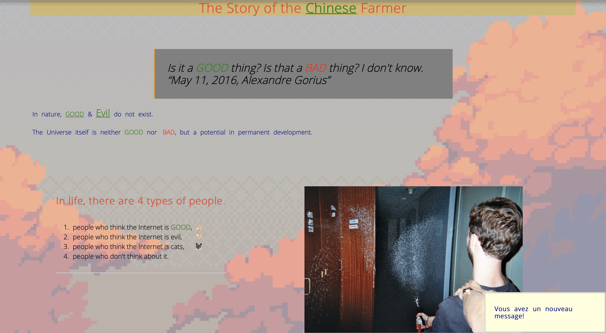

# **Welkom to my project: Chinese-farmer!**

## **Instructions**

[https://github.com/becodeorg/bxl-hopper-1-25/tree/master/The%20Field/3.HTML%2BCSS/0.progressive_enhancement](https://github.com/becodeorg/bxl-hopper-1-25/tree/master/The%20Field/3.HTML%2BCSS/0.progressive_enhancement)
> the instructions wasn't clear

## **How to run**

1. Just double click the _Index.html_

## **New skills**

It brought me new skills, in **_HTML_** and **_CSS_**

## **Which languages**

- _HTML_
- _CSS_

## **Responsive**

no , it isn't !

## **Screenshot**

